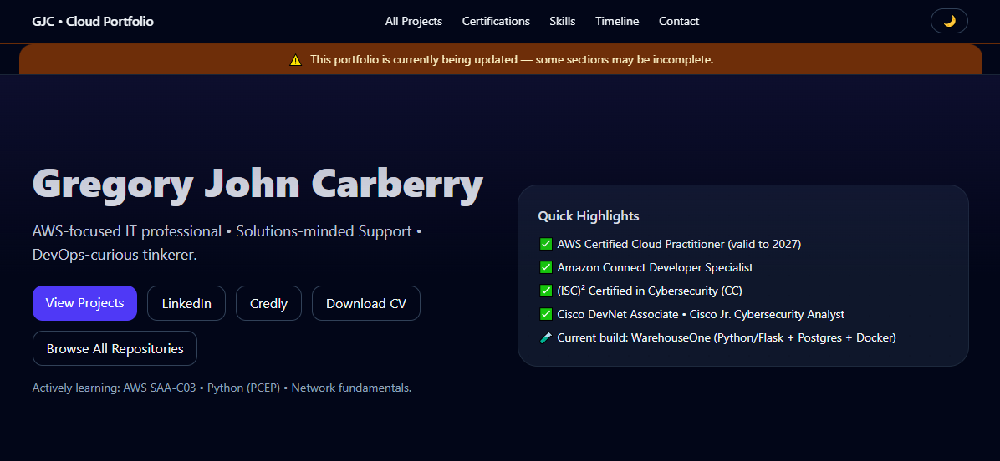
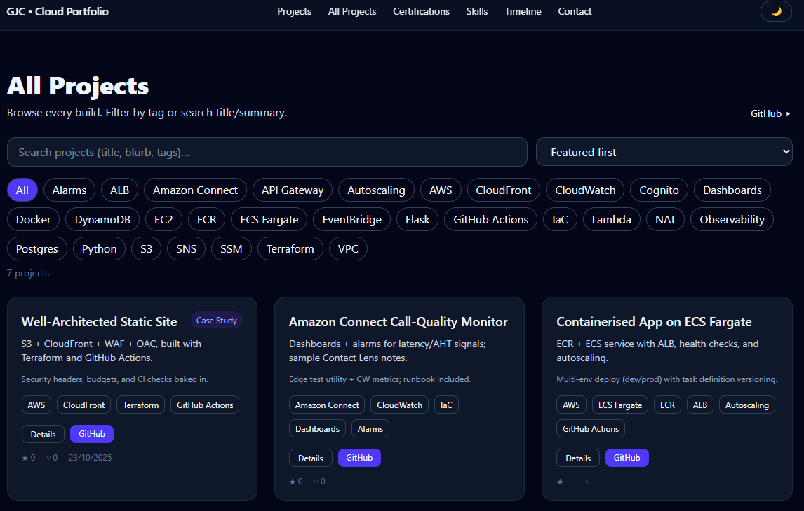

# ☁️ Gregory John Carberry — Cloud Portfolio

A modern, fast, **Tailwind CSS v4–powered** cloud portfolio showcasing AWS projects, certifications, skills, and ongoing learning — built for clarity, maintainability, and long-term growth.

This is a **static, data‑driven site** deployed on GitHub Pages using pure HTML + JavaScript + JSON (no build tools, no frameworks, no dependencies).

---

## 🚀 Major Features

### ✔️ Fully Refactored (2025)
- Migrated from Tailwind v3 → **Tailwind v4 (browser runtime)**
- Fixed **class-based dark mode** via `@custom-variant dark`
- All inline CSS/JS moved to `/assets/`
- Normalised page structure (`index.html`, `projects.html`, `project.html`)
- Removed stale service workers causing partial-load issues
- Added floating “Under Update” banner

### ✔️ 100% Data-Driven
All content is fed from JSON files:

```
/data/links.json
/data/projects.json
/data/certs.json
/data/skills.json
/data/timeline.json
```

Updating content only requires editing JSON — HTML stays untouched.

### ✔️ Project Deep-Dives
Each project loads:

- Its README from GitHub
- GitHub Markdown CSS
- Syntax highlighting via highlight.js
- Mermaid diagrams
- Prev/Next project navigation

### ✔️ PWA-Ready
(Service worker only registers on production.)

- `manifest.webmanifest`
- `sw.js` (disabled locally)

---

## 🧩 What’s Inside

### 📁 File Structure
```
root/
│   index.html
│   projects.html
│   project.html
│   manifest.webmanifest
│   sw.js
│   README.md
│
├── assets/
│     site.css
│     common.js
│     index.js
│     projects.js
│     project.js
│
├── data/
│     links.json
│     projects.json
│     certs.json
│     skills.json
│     timeline.json
│
└── icons/
      favicon, PWA icons, og-image
```

---

## 🛠️ Tech Stack Summary

| Area | Tools |
|------|-------|
| **Cloud** | AWS (S3, Lambda, CloudFront, Route 53, Connect) |
| **Frontend** | HTML • JS • Tailwind CSS v4 |
| **Infra / Automation** | Terraform • GitHub Actions |
| **Backend / Scripting** | Python |
| **Support & ITSM** | Jira • ITIL • ISO/IEC 20000 |
| **Security** | (ISC)² CC • Cisco Cybersecurity |

---

## 📈 Current Areas of Development
- Deeper project case studies
- Sticky mini-header + ToCs
- Layout/spacing polish
- Lighthouse score improvements
- More Well-Architected AWS examples
- Better caching for GitHub API calls

---

## 🖼️ Screenshots





---

## 🏗️ Architecture Diagram

### Basic Site Architecture

```
Browser
   │
   ├── HTML (index.html, projects.html, project.html)
   ├── Tailwind v4 (browser CDN)
   ├── JavaScript (assets/*.js)
   └── JSON Data (data/*.json)
         ↓
GitHub Pages Hosting
```

### Expanded (with GitHub API integration)

```
Browser
   │
   ├── Fetch local JSON → Build UI
   ├── Fetch GitHub API → Repo metadata
   │
   ├── highlight.js → Syntax highlighting
   ├── marked.js     → Markdown parsing fallback
   └── mermaid.js    → Diagrams
         ↓
GitHub Pages (static hosting)
```

---

## 📝 How to Update the Site

### ✔️ Edit Data (Most Common)
Most content lives in:

- `data/projects.json`
- `data/certs.json`
- `data/skills.json`
- `data/timeline.json`

Just edit the JSON, save, commit, push — done.

### ✔️ Update Styles
All custom CSS lives in:

```
assets/site.css
```

### ✔️ Update Behaviour (JS)
Shared logic:

```
assets/common.js
```

Page-specific logic:

```
assets/index.js
assets/projects.js
assets/project.js
```

---

## 🧪 Local Development

### ✔️ Launch with Live Server
Open VS Code → right-click `index.html` → **Open with Live Server**.

### ✔️ Important: Service Worker Is Disabled Locally
To prevent caching issues, the service worker only registers when hosted on:

```
gregorycarberry.github.io
```

---

## 🌙 How Dark Mode Works (Tailwind v4)

Tailwind v4 no longer reads JS configs like `tailwind.config = { darkMode: 'class' }`.

Instead, we define a custom variant:

```css
@custom-variant dark (&:where(.dark, .dark *));
```

Now any `.dark` class on `<html>` triggers dark-mode variants:

```html
<html class="dark">
<body class="bg-slate-50 dark:bg-slate-950">
```

The toggle in `assets/common.js` simply adds/removes `.dark`.

---

## 🔗 Connect

- **LinkedIn:** https://www.linkedin.com/in/gregory-carberry
- **Credly:** https://www.credly.com/users/gregory-carberry
- **GitHub:** https://github.com/GregoryCarberry
- **Email:** Carberry.GJ@gmail.com

---

© 2025 Gregory John Carberry · Built with Tailwind v4 · Hosted on GitHub Pages
